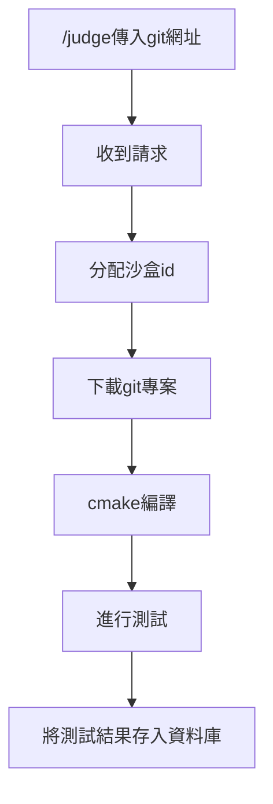

# sandbox-api
> 還在開發階段，目前功能並不完整

這個repo用於驗證想法，目標是嘗試將ioi/isolate融入，做出一個測試OOPL作業的Restful API

```mermaid
flowchart TD
    /judge傳入git網址 --> 收到請求
    收到請求 --> 分配沙盒id
    分配沙盒id --> 下載git專案
    下載git專案 --> cmake編譯
    cmake編譯 --> 進行測試
    進行測試 --> 將測試結果存入資料庫
```
